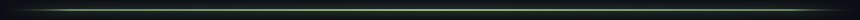
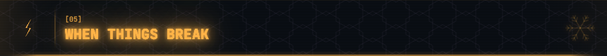
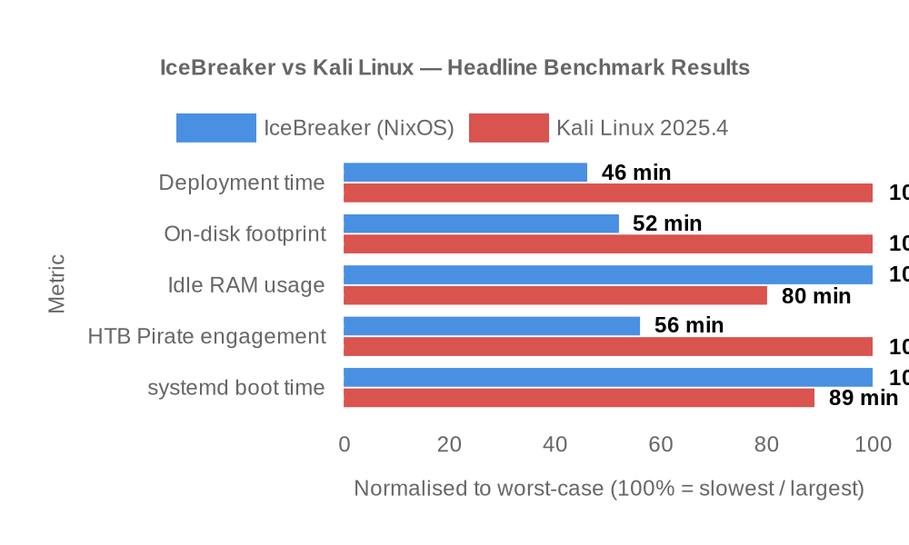
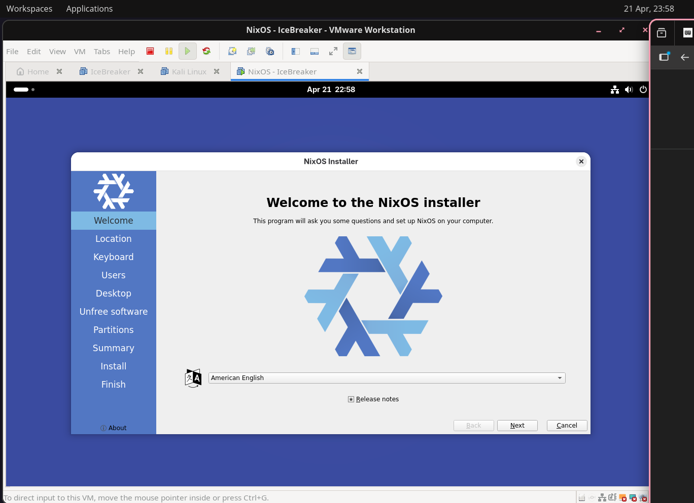
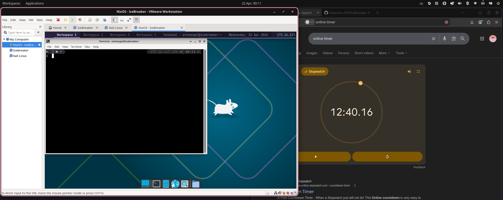
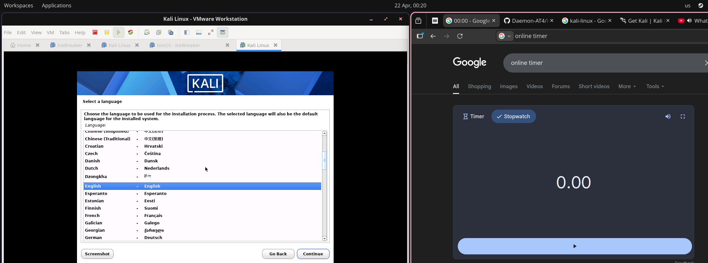
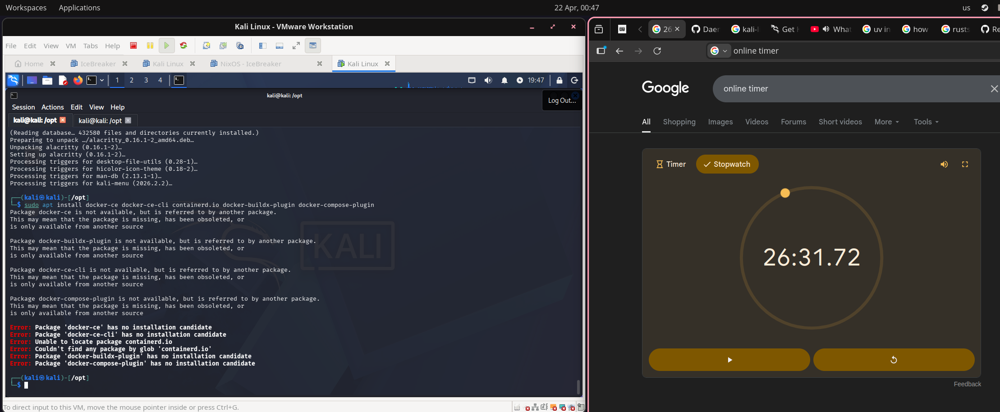
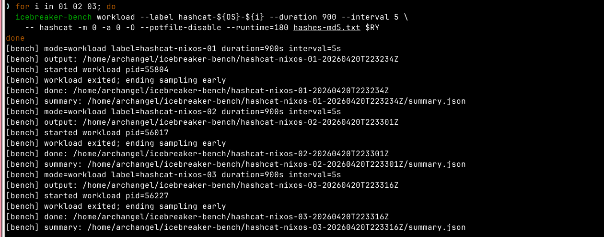
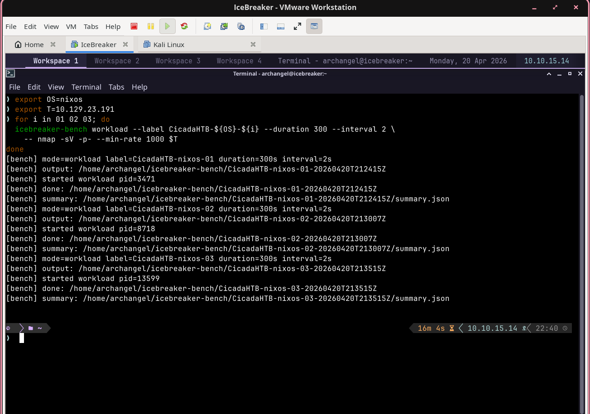
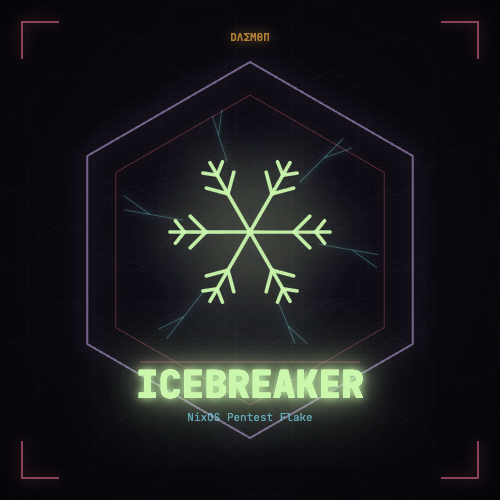

<div align="center">


<!-- ════════════════════════════════════════════════════════════════════════ -->
<!--  D Λ Σ M Ө П   // P R E S E N T S ::   I C E B R E A K E R              -->
<!--  Neuromancer-grade NixOS pentest flake                                   -->
<!-- ════════════════════════════════════════════════════════════════════════ -->

<a href="https://github.com/daemonbreaker/IceBreaker"></a>

<br/>

<!--  ░▒▓  DAEMON PALETTE  ▓▒░  phosphor · cyan · amber · pink · iris · pale   -->

<p align="center">
  
  
  
  
  
  
</p>

<br/>

<p align="center">
  
  
  
  
  
  <br/>
  
  
  
  
  
  
  <br/>
  
  
  
</p>

<p align="center">
  <a href="docs/getting-started.md"></a>
  <a href="docs/README.md"></a>
  <a href="docs/benchmarking.md"></a>
  <a href="docs/troubleshooting.md"></a>
  <a href="#12-benchmarking--nixos-vs-kali"></a>
</p>

</div>

<div align="center">
  
</div>

<a id="what-is-this"></a>
<div align="center">
  
</div>

A fully modular NixOS pentesting environment built as a Nix flake. Your entire workstation — every tool, alias, function, theme, and keybinding — declared in code.

One command rebuilds everything. One `git push` backs it all up. One `git clone` restores it anywhere.

```
> nrs                          # rebuild the entire system from ~/IceBreaker
> newbox target 10.10.10.1     # scaffold a new engagement
> htb-tmux                     # launch 3-pane workspace
> revshell bash                # generate a payload with your VPN IP
> flag HTB{owned} "root"       # log it
```

IceBreaker is also the artefact of an empirical BSc (Hons) Ethical Hacking dissertation (Bruce, 2026) benchmarking a declarative NixOS flake against Kali Linux 2025.4 across deployment time, resource use, cryptographic throughput, a full HackTheBox Active Directory engagement, and usability. The headline numbers are at the bottom of this README under [[12] BENCHMARKING — NIXOS vs KALI](#12-benchmarking--nixos-vs-kali).

## // The Name of the Project
I named the project IceBreaker as a deliberate nod to cyberpunk, and especially to the world of Neuromancer, where the digital landscape is imagined as a dangerous, living frontier. In that setting, hackers are called [netrunners](https://cyberpunk.fandom.com/wiki/Netrunner): people who dive directly into the matrix, navigating systems, defences, and hostile code as if they were moving through physical cyberspace called the [net](https://cyberpunk.fandom.com/wiki/Net) in the cyberpunk universe. That imagery has always stuck with me because it makes computing feel cinematic — not just abstract logic, but an environment with tension, risk, and personality.

The “ice” in cyberpunk slang refers to defensive countermeasures: intrusion prevention, security barriers, and hostile software designed to stop or punish unauthorized access. [Black ICE](https://cyberpunk.fandom.com/wiki/Black_ICE) is the most infamous version of that idea, usually portrayed as especially dangerous or lethal. I chose IceBreaker because it plays on that language in a way that feels fitting for a flake: something that helps you get past the cold, rigid barriers around a system, or simply makes the machine easier to approach and use. It carries both the cyberpunk atmosphere and the practical idea of breaking through hardened defences — a name that feels technical, thematic, and a little bit rebellious.


<div align="center">
  
</div>

<details>
<summary><b>// TABLE OF CONTENTS &nbsp; <code>[click to jack in]</code></b></summary>

<br/>

```
 ╔══════════════════════════════════════════════════════════════════════╗
 ║                    I C E B R E A K E R   //   T O C                  ║
 ╠══════════════════════════════════════════════════════════════════════╣
 ║ [00] PAYLOAD MANIFEST ................ what's inside                 ║
 ║ [01] SYSTEM REQUIREMENTS ............. what you need                 ║
 ║ [02] PRE-FLIGHT ...................... username + hypervisor         ║
 ║ [03] INSTALLATION .................... step by step                  ║
 ║ [04] DEPLOY FROM GITHUB .............. clone → build → hack          ║
 ║ [05] WHEN THINGS BREAK ............... manual recovery               ║
 ║ [06] DAILY OPS ....................... commands you'll use constantly║
 ║ [07] ARSENAL ......................... categories & presets          ║
 ║ [08] ADDING & REMOVING PACKAGES ...... make it yours                 ║
 ║ [09] ARCHITECTURE .................... how it's wired                ║
 ║ [10] TROUBLESHOOTING ................. flatline recovery             ║
 ║ [11] DOCUMENTATION ................... full docs index               ║
 ║ [12] BENCHMARKING — NIXOS vs KALI .... empirical dissertation data   ║
 ╚══════════════════════════════════════════════════════════════════════╝
```

| # | Section | Shortcut |
|--:|---------|----------|
| 00 | [Payload Manifest](#00-payload-manifest) | what's inside |
| 01 | [System Requirements](#01-system-requirements) | what you need |
| 02 | [Pre-Flight](#02-pre-flight) | username + hypervisor |
| 03 | [Installation](#03-installation) | step by step |
| 04 | [Deploy from GitHub](#04-deploy-from-github) | clone → build → hack |
| 05 | [When Things Break](#05-when-things-break) | manual recovery |
| 06 | [Daily Ops](#06-daily-ops) | the commands you'll use |
| 07 | [Arsenal](#07-arsenal--categories--presets) | categories & presets |
| 08 | [Adding & Removing Packages](#08-adding--removing-packages) | make it yours |
| 09 | [Architecture](#09-architecture) | how it's wired |
| 10 | [Troubleshooting](#10-troubleshooting) | flatline recovery |
| 11 | [Documentation](#11-documentation) | full docs index |
| 12 | [Benchmarking — NixOS vs Kali](#12-benchmarking--nixos-vs-kali) | empirical dissertation data |

</details>

<div align="center">
  
</div>

<a id="00-payload-manifest"></a>
<div align="center">
  
</div>

<table align="center">
<tr>
<td valign="top" width="50%">

<h3 align="center">▓▒░ <code>OFFENSIVE</code> ░▒▓</h3>

<p align="center">
<br/>
<br/>
<br/>
<br/>
<br/>
<br/>

</p>

</td>
<td valign="top" width="50%">

<h3 align="center">▓▒░ <code>ENVIRONMENT</code> ░▒▓</h3>

<p align="center">
<br/>
<br/>
<br/>
<br/>
<br/>
<br/>

</p>

</td>
</tr>
</table>

<div align="center">
  
</div>

<a id="01-system-requirements"></a>
<div align="center">
  
</div>

- **NixOS** — any starting channel (the flake pins `nixos-unstable`)
- **Architecture** — x86_64-linux or aarch64-linux
- **Disk** — 20 GB minimum, 50 GB+ recommended for `full` preset
- **RAM** — 4 GB minimum, 8 GB+ recommended
- **Network** — internet connection during first build (20–60 min)
- **Hypervisor** — VMware, QEMU/KVM, VirtualBox, or bare metal

<div align="center">
  
</div>

<a id="02-pre-flight"></a>
<div align="center">
  
</div>

Read this **before** running anything.

### // USERNAME

IceBreaker defaults to a user called **`archangel`**. You should change this to match the username you created during NixOS installation — that way your existing password and home directory just work.

Edit these four files (before or after running setup, then rebuild):

| File | What to change |
|------|----------------|
| `modules/system/base.nix` | `users.users.archangel` → `users.users.YOURNAME` |
| `modules/system/nix-helpers.nix` | `"archangel"` in `trusted-users` → `"YOURNAME"` |
| `home/default.nix` | `home.username`, `home.homeDirectory`, `git user.name`, `git user.email` |
| `flake.nix` | `users.archangel` → `users.YOURNAME` |

Every occurrence of `archangel` must become your chosen username. You can search for it:

```bash
grep -rn "archangel" --include="*.nix" .
```

> IceBreaker defines its own user in `base.nix`. Unless you edit the username to match your NixOS install user, you'll have two separate accounts. The IceBreaker user is the one with all the tooling, aliases, prompt, and theme.

### // HYPERVISOR

VMware is enabled by default. If you're on something else, edit `modules/system/base.nix` — look for the virtualisation section:

```nix
# VMware (default)
virtualisation.vmware.guest.enable = true;

# QEMU/KVM — uncomment these, set VMware to false:
# services.qemuGuest.enable = true;
# services.spice-vdagentd.enable = true;  # only with SPICE display

# VirtualBox — uncomment this, set VMware to false:
# virtualisation.virtualbox.guest.enable = true;
```

Bare metal: set all to `false`.

> Auto-detection doesn't work in Nix flakes — pure evaluation prohibits reading `/sys/` paths.

### // BOOTLOADER

Default is GRUB MBR on `/dev/sda`. If you use UEFI or a different disk, edit `modules/system/base.nix`:

```nix
# MBR (default):
boot.loader.grub.device = "/dev/sda";  # change to your disk

# UEFI — replace the GRUB block with:
# boot.loader.systemd-boot.enable = true;
# boot.loader.efi.canTouchEfiVariables = true;
```

<div align="center">
  
</div>

<a id="03-installation"></a>
<div align="center">
  
</div>

### Step 1 — Install NixOS

Download the ISO from [nixos.org/download](https://nixos.org/download). Minimal or graphical — doesn't matter. IceBreaker replaces the desktop entirely.

### Step 2 — Get Git

On a fresh minimal install, `git` won't be available. Drop into a temporary shell:

```bash
nix-shell -p git
```

### Step 3 — Clone IceBreaker

```bash
git clone https://github.com/YOUR_USERNAME/IceBreaker.git ~/IceBreaker
cd ~/IceBreaker
```

> `hardware-configuration.nix` is **not** in the repo — it's machine-specific and gitignored. The setup script copies yours from `/etc/nixos/` automatically.

### Step 4 — Edit Username / Hypervisor (if needed)

See [PRE-FLIGHT](#02-pre-flight). If you're keeping `archangel` and on VMware, skip this.

### Step 5 — Run Setup

```bash
cd ~/IceBreaker
./scripts/setup.sh
```

The script runs five steps:

| Step | What it does |
|------|-------------|
| 1/5 | Copies `hardware-configuration.nix` from `/etc/nixos/` |
| 2/5 | Makes all scripts in `scripts/` executable |
| 3/5 | Creates `~/targets/`, `~/ctf/`, `~/vpn/` |
| 4/5 | Runs `nix flake update` (fetches nixpkgs, home-manager, stylix) |
| 5/5 | Runs `sudo nixos-rebuild switch --flake ~/IceBreaker#icebreaker` |

Step 5 takes the longest — 20–60 minutes on first run. It's downloading the entire package set. This is normal.

> **The bootstrap problem:** Fresh NixOS doesn't have flakes enabled. `/etc/nix/nix.conf` is a read-only symlink into the Nix store — you literally cannot edit it. The setup script passes `--extra-experimental-features 'nix-command flakes'` to `nix` and `--option extra-experimental-features 'nix-command flakes'` to `nixos-rebuild` for the bootstrap. After the first rebuild, `nix-helpers.nix` permanently enables flakes and these flags are never needed again.

### Step 6 — Reboot

```bash
sudo reboot
```

Log in at the LightDM screen with the username and password you set during NixOS installation (or `archangel` if you haven't changed it yet).

### Step 7 — Install Pipx Tools

Some tools aren't in nixpkgs or have broken builds. These are installed via pipx in isolated virtualenvs:

```bash
~/IceBreaker/scripts/install-pipx-tools.sh
```

### Step 8 — Read the Guide

```bash
guide
```

Interactive terminal walkthrough covering categories, aliases, functions, scripts, and tips.

<div align="center">
  
</div>

<a id="04-deploy-from-github"></a>
<div align="center">
  
</div>

This is the real power of a Nix flake. Your entire environment — every tool, every alias, every theme colour — restores from a single `git clone`.

```
 ░▒▓ J A C K - I N   F L O W ▓▒░

   ┌─────────────┐  nix   ┌─────────────┐  nh   ┌─────────────┐  ssh  ┌─────────────┐
   │  git clone  │ ─────▶ │  flake.nix  │ ────▶ │   rebuild   │ ────▶ │   jack in   │
   │ ~/IceBreaker│        │ flake.lock  │       │nixos-rebuild│       │archangel@ice│
   └─────────────┘        └─────────────┘       └─────────────┘       └─────────────┘
         │                       │                     │                     │
         ▼                       ▼                     ▼                     ▼
    ░  payload  ░           ░ dependency ░        ░  atomic   ░         ░ rose-pine ░
    ░  manifest ░           ░  content-  ░        ░generation ░         ░  + p10k   ░
    ░ 20 GB min ░           ░ addressed  ░        ░ rollback? ░         ░  + tmux   ░
    ░           ░           ░reproducible░        ░ one flag  ░         ░  + vpn-ip ░
```


### // Fresh NixOS Machine

```bash
# 1. Get git
nix-shell -p git

# 2. Clone
git clone https://github.com/YOUR_USERNAME/IceBreaker.git ~/IceBreaker

# 3. (Optional) Edit username — see PRE-FLIGHT
# 4. Run setup
cd ~/IceBreaker && ./scripts/setup.sh

# 5. Reboot, log in as archangel / icebreaker
sudo reboot

# 6. Change password, start new shell, install pipx tools
passwd
exec zsh
~/IceBreaker/scripts/install-pipx-tools.sh
```

### // Existing NixOS Machine

```bash
git clone https://github.com/YOUR_USERNAME/IceBreaker.git ~/IceBreaker
cd ~/IceBreaker
./scripts/setup.sh     # copies hardware-configuration.nix from /etc/nixos/ automatically
```

### // ARM64 (aarch64)

```bash
sudo nixos-rebuild switch --flake ~/IceBreaker#icebreaker-aarch64
```

Some packages (burpsuite, metasploit) may not have ARM64 binaries — comment them out in the relevant category file if the build fails.

### // Keeping Multiple Machines in Sync

```bash
# Machine A — change config, push
cd ~/IceBreaker && git add -A && git commit -m "enabled AD tools" && git push

# Machine B — pull and rebuild
cd ~/IceBreaker && git pull && nrs
```

`hardware-configuration.nix` is gitignored — each machine generates its own. Everything else syncs.

<div align="center">
  
</div>

<a id="05-when-things-break"></a>
<div align="center">
  
</div>

The setup script tracks errors and prints manual instructions if anything fails. If you see the red error box, follow these steps.

### // Manual Step 1 — Hardware Configuration

```bash
# Copy from /etc/nixos/
sudo cp /etc/nixos/hardware-configuration.nix ~/IceBreaker/
sudo chown $(id -u):$(id -g) ~/IceBreaker/hardware-configuration.nix

# If /etc/nixos/ doesn't have it either:
sudo nixos-generate-config --show-hardware-config > ~/IceBreaker/hardware-configuration.nix
```

### // Manual Step 2 — Update the Flake

```bash
cd ~/IceBreaker
nix --extra-experimental-features 'nix-command flakes' flake update
```

> **Why the flag?** `/etc/nix/nix.conf` on NixOS is a symlink into `/nix/store/` — a read-only, content-addressed, immutable filesystem. Even `sudo` can't write to it. This is by design. The `--extra-experimental-features` flag enables flakes for this single command. After the first rebuild, `nix-helpers.nix` enables flakes permanently.

### // Manual Step 3 — Rebuild

```bash
# CRITICAL: nixos-rebuild uses --option, NOT --extra-experimental-features
# They are DIFFERENT commands with DIFFERENT flag syntax
sudo nixos-rebuild switch \
  --flake ~/IceBreaker#icebreaker \
  --option extra-experimental-features "nix-command flakes"
```

**If it fails with a package error:** The error names the package. Find it in `modules/pentesting/*.nix`, comment it out, try again. Package names in nixpkgs-unstable change frequently — check [DEVLOG.md](DEVLOG.md) for known renames.

**If it fails with "unrecognized arguments":** You used `--extra-experimental-features` on `nixos-rebuild`. It's `--option extra-experimental-features` for that command.

### // Manual Step 4 — New Shell

```bash
exec zsh
```

### // Manual Step 5 — Pipx Tools

```bash
~/IceBreaker/scripts/install-pipx-tools.sh
```

### // Common Failures

| Symptom | Cause | Fix |
|---------|-------|-----|
| `unrecognized arguments: --extra-experimental-features` | Wrong flag on `nixos-rebuild` | Use `--option extra-experimental-features` |
| `cannot find attribute 'icebreaker'` | Flake output mismatch | Check `nixosConfigurations.icebreaker` in `flake.nix` |
| `hardware-configuration.nix: No such file` | Missing hardware config | Run `sudo nixos-generate-config --show-hardware-config > ~/IceBreaker/hardware-configuration.nix` |
| Build fails on a package | Package renamed or removed | Comment it out in `modules/pentesting/*.nix`, rebuild |
| `nrs: command not found` | Still in bash, not zsh | `exec zsh` |
| "Failed to start session" at login | Missing `defaultSession` | Add `services.displayManager.defaultSession = "xfce";` to `base.nix` |
| Black screen after login | Wrong hypervisor setting | Set correct hypervisor in `base.nix`, rebuild, reboot |
| p10k prompt missing | Not logged in as IceBreaker user | Log in as `archangel` (or your configured username) |
| Alacritty "conflicting definitions" | Manual colours/fonts set | Stylix manages colours/fonts/opacity — remove them from `home/default.nix` |

### // Rolling Back

NixOS keeps a snapshot of every rebuild. If something breaks:

1. Reboot
2. In GRUB, select a previous generation
3. Fix the config
4. `nrs`

From a working shell:

```bash
ngen    # list all generations
nhc     # garbage collect, keep 3 most recent
```

<div align="center">
  
</div>

<a id="06-daily-ops"></a>
<div align="center">
  
</div>

### // Rebuild Commands

```bash
nrs     # nh os switch ~/IceBreaker  — rebuild + switch immediately
nrt     # nh os test ~/IceBreaker    — test without boot entry
nrb     # nh os boot ~/IceBreaker    — build + boot entry, don't switch yet
nfu     # nix flake update           — update nixpkgs, home-manager, stylix
nfc     # nix flake check            — check for eval errors without building
```

After `nrs`, the running system is updated live. No reboot needed (except kernel updates).

### // Engagement Workflow

```bash
htb                                # connect VPN
newbox forest 10.10.10.161        # create target scaffold + set $TARGET/$LHOST
htb-tmux                           # 3-pane tmux layout

nmap-init                          # quick scan → ./nmap/initial
nmap-allports                      # all 65535 ports → ./nmap/allports
nmap-targeted $TARGET 88,445      # deep scan specific ports

flag "HTB{fl4g_v4lu3}" "user"     # log flag with timestamp
cred admin P@ssw0rd ssh            # log credentials

revshell bash                      # generate reverse shell with $LHOST/$LPORT
rlisten                            # nc -lvnp 4444 with readline

vpnstop                            # kill VPN when done
```

### // VPN

```bash
htb         # sudo openvpn ~/vpn/htb.ovpn
thm         # sudo openvpn ~/vpn/thm.ovpn
vpnstop     # sudo pkill openvpn
vpnip       # show tun0/tun1 IP
```

### // Updating

```bash
nfu && nrs     # update all inputs + rebuild
```

<div align="center">
  
</div>

<a id="07-arsenal--categories--presets"></a>
<div align="center">
  
</div>

```
 ░▒▓ A R S E N A L   C O N S T E L L A T I O N ▓▒░

   ┌──────────────┐  ┌──────────────┐  ┌──────────────┐  ┌──────────────┐
   │  ░ NETWORK ░ │  │  ░   WEB   ░ │  │  ░    AD   ░ │  │  ░ PASSWORD ░│
   │   nmap/mass  │  │  burp/ffuf  │  │ bloodhound  │  │ hashcat/john │
   │  rustscan/   │  │  sqlmap/    │  │  impacket/  │  │  hydra/      │
   │  wireshark   │  │  nuclei     │  │  netexec    │  │  seclists    │
   └──────────────┘  └──────────────┘  └──────────────┘  └──────────────┘
   ┌──────────────┐  ┌──────────────┐  ┌──────────────┐  ┌──────────────┐
   │ ░ WIRELESS ░ │  │░ FORENSICS ░ │  │  ░   REV  ░  │  │  ░  MITM   ░ │
   │ aircrack-ng  │  │ volatility3 │  │ ghidra/r2   │  │ bettercap/   │
   │  kismet/     │  │  binwalk/   │  │  gef/       │  │  ettercap/   │
   │  wifite2     │  │  steghide   │  │  pwntools   │  │  dsniff      │
   └──────────────┘  └──────────────┘  └──────────────┘  └──────────────┘
   ┌──────────────┐  ┌──────────────┐  ┌──────────────┐  ┌──────────────┐
   │ ░ BLUE-TEAM ░│  │ ░ EXPLOIT  ░ │  │ ░ POST-EXP ░ │  │  ░  CLOUD  ░ │
   │ suricata/    │  │ metasploit/ │  │ chisel/     │  │ awscli2/     │
   │ yara/zeek/   │  │ searchsploit│  │ ligolo-ng/  │  │ gcloud/      │
   │ hayabusa     │  │  exploitdb  │  │ havoc/villain│  │ terraform   │
   └──────────────┘  └──────────────┘  └──────────────┘  └──────────────┘

         ▓▒░ 4 presets: [ctf] · [engagement] · [full] · [blue] ░▒▓
```

<p align="center">
  
  
  
  
</p>

Edit `configuration.nix` to arm your loadout:

```nix
pentesting = {
  enable = true;

  # ── Option A: Use a preset ────────────────────────
  # preset = "ctf";         # network, web, password, forensics, reverseEngineering, exploitation
  # preset = "engagement";  # network, web, AD, password, mitm, exploitation, postExploitation, cloud
  # preset = "full";        # all 12 categories
  # preset = "blue";        # network, forensics, blueTeam

  # ── Option B: Toggle individually ─────────────────
  categories = {
    network            = true;   # nmap, masscan, rustscan, wireshark, dns tools
    web                = true;   # burpsuite, ffuf, sqlmap, nuclei, nikto, dalfox
    activeDirectory    = false;  # bloodhound, impacket, netexec, responder, evil-winrm
    password           = true;   # hashcat, john, hydra, seclists
    wireless           = false;  # aircrack-ng, kismet, wifite2, reaver
    forensics          = false;  # volatility3, binwalk, sleuthkit, steghide
    reverseEngineering = false;  # ghidra, radare2, gdb+gef, pwntools, angr
    mitm               = false;  # bettercap, ettercap, dsniff
    blueTeam           = false;  # suricata, snort, yara, zeek, chainsaw, hayabusa
    exploitation       = false;  # metasploit, searchsploit/exploitdb
    postExploitation   = false;  # chisel, ligolo-ng, proxychains, havoc, villain
    cloud              = false;  # awscli2, google-cloud-sdk, azure-cli, terraform
  };
};
```

Presets use `mkDefault` — individual toggles **always** override:

```nix
# Use full preset but drop wireless and cloud
pentesting.preset = "full";
pentesting.categories.wireless = false;
pentesting.categories.cloud = false;
```

Then rebuild: `nrs`

See [docs/categories.md](docs/categories.md) for the full tool listing per category.

<div align="center">
  
</div>

<a id="08-adding--removing-packages"></a>
<div align="center">
  
</div>

### // Adding a Package to a Pentesting Category

Open the relevant module in `modules/pentesting/`. Example — adding `whatweb` to web tools:

```nix
# modules/pentesting/web.nix
environment.systemPackages = with pkgs; [
  # ... existing tools ...
  whatweb        # add your package here
];
```

Rebuild: `nrs`

### // Removing a Package

Same file — delete or comment out the line:

```nix
# modules/pentesting/web.nix
environment.systemPackages = with pkgs; [
  # whatweb      # commented out — not needed for this engagement
  ffuf
  sqlmap
  # ...
];
```

Rebuild: `nrs`. The package is removed from your system. NixOS doesn't leave orphans behind.

### // Adding a Package to the Base System (always installed)

Edit `modules/system/base.nix` — find the `environment.systemPackages` list and add your package:

```nix
environment.systemPackages = with pkgs; [
  # ... existing packages ...
  obsidian       # note-taking
  flameshot      # screenshots
  chromium       # browser
];
```

These are installed regardless of which pentesting categories are enabled.

### // Adding a Package via Home-Manager (user-level)

Edit `home/default.nix`:

```nix
home.packages = with pkgs; [
  # ... existing packages ...
  my-tool
];
```

Home-manager packages live in `~/.nix-profile/` instead of system-wide `/run/current-system/`. Use this for personal tools that don't need root.

### // Finding Package Names

```bash
# Search nixpkgs for a package
ns my-tool                     # alias for: nix search nixpkgs my-tool

# Check if a specific package name exists
nix eval nixpkgs#my-tool.name

# Run a package without installing it (try before you buy)
nrun my-tool                   # alias for: nix run nixpkgs#my-tool

# Find which package provides a command you need
, some-command                 # comma — finds and runs it, shows the package name
```

### // Package Name Pitfalls

nixpkgs-unstable renames things frequently. Known gotchas:

| You might try | Correct name | Notes |
|---------------|-------------|-------|
| `impacket` | `python3Packages.impacket` | Not a top-level package |
| `noto-fonts-emoji` | `noto-fonts-color-emoji` | Renamed |
| `du-dust` | `dust` | Alias is misleading |
| `snmp` | `net-snmp` | Renamed |
| `ldaputils` | `openldap` | Provides ldapsearch etc. |
| `wifite` | `wifite2` | v1 removed |
| `python3Packages.jwt` | `python3Packages.pyjwt` | jwt doesn't exist |
| `hayabusa` | `hayabusa-sec` | `hayabusa` is an unrelated package |
| `neofetch` | `fastfetch` | neofetch removed (unmaintained) |

If a package doesn't exist at all, add it to `scripts/install-pipx-tools.sh` instead (for Python tools) or install it via `nix-shell -p` on demand.

### // Creating a New Pentesting Category

**1. Create the module** — use `cloud.nix` as a template:

```nix
# modules/pentesting/my-category.nix
{ config, lib, pkgs, ... }:

with lib;

let cfg = config.pentesting; in

{
  config = mkIf (cfg.enable && cfg.categories.myCategory) {
    environment.systemPackages = with pkgs; [
      tool1
      tool2
    ];
  };
}
```

**2. Register the option** in `modules/pentesting/default.nix`:

```nix
imports = [
  # ... existing imports ...
  ./my-category.nix
];

options.pentesting.categories = {
  # ... existing options ...
  myCategory = mkEnableOption "my custom tools";
};
```

**3. Add to presets** (optional) in `modules/pentesting/presets.nix`:

```nix
(mkIf (cfg.preset == "full") {
  pentesting.categories.myCategory = mkDefault true;
})
```

**4. Add toggle** in `configuration.nix`:

```nix
pentesting.categories.myCategory = true;
```

**5. Rebuild:** `nfc && nrs`

### // Adding Aliases

Edit `home/aliases.nix`:

```nix
programs.zsh.shellAliases = {
  # ... existing aliases ...
  "myalias" = "command --flag $HOME/path";
};
```

Rules:
- Use `$HOME` not `~` in paths (tilde doesn't expand in double quotes)
- Escape special characters: `\\n` for newline
- Test the command manually before adding

### // Adding Shell Functions

Edit `home/zsh.nix`, append to the string block in `initContent`:

```nix
''
  myfunction() {
    local arg="''${1:-default}"    # ''${} is Nix escaping for ${} in shell
    echo "Working on $arg"
  }
''
```

Nix escaping rules for shell code:
- `${var}` → write as `''${var}` inside `''...''` strings
- `$VAR` (no braces) → safe as-is
- `$(command)` → safe as-is

### // Adding Pipx Tools

Edit `scripts/install-pipx-tools.sh` and add under the relevant section:

```bash
pipx_install "package-name" "Display Name"
```

<div align="center">
  
</div>

<a id="09-architecture"></a>
<div align="center">
  
</div>

```
 ░▒▓ S Y S T E M   W I R I N G ▓▒░

 flake.nix                             ◉  entry point — inputs + nixosConfigurations
  │
  ├── hardware-configuration.nix       ⚠  machine-specific (NOT in git)
  ├── configuration.nix                ⚙  toggle categories + presets here
  │
  ├── modules/system/
  │   ├── base.nix                     ▸  boot, XFCE, LightDM, users, core packages
  │   ├── nix-helpers.nix              ▸  nh, comma, nil, nix-index, formatters
  │   └── stylix.nix                   ▸  Rose Pine dark, fonts, opacity
  │
  ├── modules/pentesting/
  │   ├── default.nix                  ☰  options tree (pentesting.enable + categories.*)
  │   ├── network.nix                  ⚔  nmap, masscan, rustscan, wireshark
  │   ├── web.nix                      ⚔  burpsuite, ffuf, sqlmap, nuclei, nikto
  │   ├── active-directory.nix         ⚔  bloodhound, impacket, netexec, responder
  │   ├── password.nix                 ⚔  hashcat, john, hydra, seclists
  │   ├── wireless.nix                 ⚔  aircrack-ng, kismet, wifite2, reaver
  │   ├── forensics.nix                ⚔  volatility3, binwalk, sleuthkit, steghide
  │   ├── reverse-engineering.nix      ⚔  ghidra, radare2, gdb+gef, pwntools, angr
  │   ├── mitm.nix                     ⚔  bettercap, ettercap, dsniff
  │   ├── blue-team.nix                ⚔  suricata, snort, yara, zeek, chainsaw
  │   ├── exploitation.nix             ⚔  metasploit, exploitdb/searchsploit
  │   ├── post-exploitation.nix        ⚔  chisel, ligolo-ng, proxychains, havoc
  │   ├── cloud.nix                    ⚔  awscli2, gcloud, azure-cli, terraform
  │   └── presets.nix                  ☰  preset system (ctf, engagement, full, blue)
  │
  ├── home/
  │   ├── default.nix                  ◈  home-manager: git, tmux, alacritty, fzf, bat
  │   ├── zsh.nix                      ◈  ZSH + oh-my-zsh + p10k + functions + plugins
  │   ├── aliases.nix                  ◈  50+ aliases
  │   └── p10k.zsh                     ◈  powerlevel10k config (Rose Pine + VPN/ping)
  │
  └── scripts/
      ├── setup.sh                     ▶  first-time setup (5 steps)
      ├── install-pipx-tools.sh        ▶  25+ Python tools not in nixpkgs
      ├── revshell.sh                  ▶  reverse shell generator (14 types)
      ├── tmux-htb.sh                  ▶  3-pane HTB tmux layout
      └── icebreaker-guide.sh          ▶  interactive terminal walkthrough

 Legend:  ◉ root  ⚙ config  ▸ system module  ⚔ offensive module
          ☰ options tree  ◈ user-level  ▶ executable  ⚠ local-only
```

### // Design Decisions

**home-manager is embedded** — not standalone. `nh os switch` rebuilds system + home together. There's no separate `home-manager switch` step. `hms` and `nrs` are the same command.

**Stylix auto-injects into home-manager** — the NixOS module handles it. Never add stylix to `home-manager.sharedModules` — causes duplicate definition errors.

**EXTENDED_GLOB is disabled in ZSH** — it makes `#` a glob operator, which breaks flake refs like `~/IceBreaker#icebreaker`. Don't re-enable it.

**hardware-configuration.nix is gitignored** — it contains filesystem UUIDs and hardware specific to one machine. Each host generates its own.

**Docker is always enabled** — with auto-prune. Available regardless of pentesting categories.

<div align="center">
  
</div>

<a id="10-troubleshooting"></a>
<div align="center">
  
</div>

### // "Failed to start session" at LightDM

`base.nix` needs:
```nix
services.displayManager.defaultSession = "xfce";
```
Note: this is `services.displayManager.defaultSession`, **not** `services.xserver.displayManager.defaultSession` — the option moved namespaces.

### // Black screen after login (cursor visible)

Wrong hypervisor. VMware guest tools on a KVM machine (or vice versa). Fix the hypervisor setting in `base.nix`, rebuild, reboot.

### // `nrs: command not found`

You're in bash, not zsh: `exec zsh`

### // Powerlevel10k prompt not showing

Not logged in as the IceBreaker user, or Nerd Font not loaded. Log in as `archangel`, open Alacritty (Stylix configures the font automatically). If glyphs are boxes, log out and back in.

### // `experimental feature 'flakes' is disabled`

First run — use the bootstrap flag:
```bash
nix --extra-experimental-features 'nix-command flakes' flake update
```

### // Package build failure

Package renamed or removed in nixpkgs-unstable. Read the error (it names the package), comment it out in `modules/pentesting/*.nix`, rebuild. Check [DEVLOG.md](DEVLOG.md) for known renames.

### // Stylix "conflicting definitions"

You set `colors`, `font`, or `window.opacity` in Alacritty/FZF settings while Stylix also manages them. Remove those settings — Stylix owns all theming.

### // System won't boot

Reboot → GRUB → select a previous generation → fix the config → `nrs`.

<div align="center">
  
</div>

<a id="11-documentation"></a>
<div align="center">
  
</div>

<div align="center">

| # | Guide | What's inside |
|--:|-------|---------------|
| 01 | <a href="docs/getting-started.md"></a> | installation, first rebuild, basic usage |
| 02 | <a href="docs/github-setup.md"></a> | push to GitHub, rebuild from GitHub |
| 03 | <a href="docs/categories.md"></a> | all 12 categories with tool tables |
| 04 | <a href="docs/aliases.md"></a> | complete alias listing |
| 05 | <a href="docs/shell-functions.md"></a> | settarget, newbox, flag, cred, nmap helpers |
| 06 | <a href="docs/scripts.md"></a> | revshell, htb-tmux, setup, pipx installer |
| 07 | <a href="docs/workflow.md"></a> | engagement workflow: box setup → flag capture |
| 08 | <a href="docs/customisation.md"></a> | add packages, create categories, change theme |
| 09 | <a href="docs/theming.md"></a> | Stylix, Rose Pine, fonts, prompt |
| 10 | <a href="docs/troubleshooting.md"></a> | common issues and fixes |
| 11 | <a href="docs/benchmarking.md"></a> | NixOS vs Kali performance methodology |
| ∙∙ | <a href="DEVLOG.md"></a> | development history — every bug and fix |

</div>

<div align="center">
  
</div>

<a id="12-benchmarking--nixos-vs-kali"></a>
<div align="center">
  
</div>

IceBreaker was built, in part, as the practical artefact for a BSc (Hons) Ethical Hacking dissertation (Bruce, 2026, Abertay University) asking whether a declarative NixOS flake can serve as a reproducible alternative to Kali Linux for professional penetration-testing work. It was evaluated empirically against **Kali Linux 2025.4** across five dimensions on identical virtualised hardware (VMware Workstation on AMD Ryzen 9 6900HX, 4 vCPU, 8 GiB RAM, 40 GiB disk per guest).

The headline numbers are summarised below; the full methodology, per-run JSON captures, and threats to validity are in [docs/benchmarking.md](docs/benchmarking.md) and the dissertation itself.

### // Headline Results

```
 ░▒▓ H E A D L I N E   D E L T A S ▓▒░  (█ = IceBreaker,  ▓ = Kali)

 Deploy time       Ice ████████████░░░░░░░░░░░░░  12 min
                   Kal ██████████████████████████  26 min     ▼ IceBreaker 54 % faster

 Disk closure      Ice ████████████░░░░░░░░░░░░░  14.19 GB
                   Kal █████████████████████████▓  27.51 GB   ▼ IceBreaker 49 % smaller

 Idle RAM          Ice ███████████████████░░░░░░  1,149.6 MiB
                   Kal ████████████████░░░░░░░░░  923.8 MiB   ▲ Kali 19.6 % leaner

 Boot (systemd)    Ice ██████████████████████░░░  8.557 s
                   Kal ████████████████████░░░░░  7.606 s     ≈ parity (~1 s)

 HTB Pirate        Ice ██████████████░░░░░░░░░░░  746 s
                   Kal █████████████████████████  1,334 s     ▼ IceBreaker 44.1 % faster

 SUS usability     Ice █████████████████████████  82.5  (Excellent)
                   Kal █████████████████████░░░░  72.5  (Acceptable)  +10 IceBreaker
```

| Dimension | IceBreaker (NixOS 26.05) | Kali Linux 2025.4 | Result |
|---|---:|---:|---|
| End-to-end deployment | **12 min** | 26 min | IceBreaker **54 % faster** |
| On-disk package closure | **14.19 GB** | 27.51 GB | IceBreaker **49 % smaller** (despite 82 **more** packages) |
| Package count | 2,816 (nix-store) | 2,898 (dpkg -l) | +82 on Kali |
| Idle RAM (mean, 5 min) | 1,149.6 MiB | **923.8 MiB** | Kali **19.6 % leaner** (home-manager overhead on Nix) |
| systemd boot time | 8.557 s | **7.606 s** | ≈1 s on Kali |
| HackTheBox Pirate (soak, wall-clock) | **746 s** | 1,334 s | IceBreaker **44.1 % faster** |
| SUS usability score (self-rated, n=1) | **82.5 — Excellent** | 72.5 — Acceptable | +10 points IceBreaker |



**Verdict:** on identical hardware IceBreaker deploys materially faster, uses half the disk for a superset of packages, ties or wins on an end-to-end AD engagement, and scores higher on self-reported usability. Kali wins on steady-state idle RAM, documentation, and match-with-real-world — areas a decade of Debian lineage buys that three months of solo work cannot.

### // Deployment — 12 min vs 26 min

Both installs were timed from the first interactive screen of the installer to a fully-functional desktop with the tool surface available. IceBreaker's figure includes the whole declarative materialisation from `flake.lock` (kernel, XFCE, all 12 tool categories in the `full` preset, home-manager layer) in a single `nixos-rebuild switch`. Kali's figure covers the graphical installer and first login with `kali-linux-default` in place — bloodyAD, BloodHound-CE and Certipy were installed after the meta-package on first pass.

| IceBreaker — installer starts at 23:58 | IceBreaker — logged in at 00:11 (**12 min**) |
|---|---|
|  |  |

| Kali Linux — installer starts at 00:20 | Kali Linux — logged in at 00:47 (**26 min**) |
|---|---|
|  |  |

On subsequent operator-skill-corrected runs (VMware template baked, post-install script primed with bloodyAD / BloodHound-CE / Certipy) Kali came down to **20 min** on the second pass and **16 min** on the third. Even on Kali's best timing IceBreaker retains a ~25 % advantage, and does so without the operator having to remember the tool-provisioning invocations at all — they live in the flake.

### // Hardware Parity

Both guests were configured identically at the hypervisor level — 4 vCPU, 8 GiB RAM, 40 GiB disk, NAT adapter — so any measured delta is attributable to the OS layer, not the host.



### // Per-Tool Performance (cross-distribution crypto suite)

`blueteam-bench` ran a 12-phase cryptographic regression on both hosts under the same harness (both linked against OpenSSL 3.6.1). The aggregate picture is **neutral, not one-sided** — some phases favour each distribution, neither imposes a systemic penalty:

| Phase / Metric | IceBreaker | Kali | Δ (Kali vs NixOS) |
|---|---:|---:|---:|
| AES-256-CBC encrypt (MiB/s) | 196.71 | **421.41** | **+114 %** Kali |
| AES-256-CBC decrypt (MiB/s) | 228.40 | **831.82** | **+264 %** Kali |
| AES-256-GCM peak (MiB/s) | **5,025.57** | 4,900.23 | −2.5 % (tied) |
| ChaCha20 peak (MiB/s) | **4,392.27** | 2,267.90 | **−48 %** (NixOS +94 %) |
| SHA-256 openssl peak (MiB/s) | **2,065.21** | 576.36 | **−72 %** (NixOS +258 %) |
| BLAKE2b peak (MiB/s) | 1,024.24 | 1,043.99 | +1.9 % (tied) |
| RSA-2048 sign (ops/s) | **2,039.4** | 1,568.0 | −23 % |
| RSA-2048 verify (ops/s) | **71,777.6** | 53,840.4 | −25 % |
| ECDSA-P256 sign (ops/s) | **61,623.8** | 57,822.8 | −6.2 % |
| gzip compress (MiB/s) | **59.43** | 53.83 | −9.4 % |
| zstd compress (MiB/s) | **283.16** | 271.04 | −4.3 % |
| FIM initial hash (files/s) | 31,285 | **33,466** | +7.0 % |

The splits trace to differing OpenSSL compile flags in nixpkgs vs Debian packaging — AES-CBC favours Kali's AES-NI-accelerated cipher path; ChaCha20, SHA-256 and RSA favour nixpkgs's build. AES-GCM, BLAKE2 and ECDSA are tied.

For the per-tool micro-benchmarks that ran cleanly on IceBreaker only (hashcat MD5 at 3.14 MH/s, openssl AES-256-GCM at 5.06 GiB/s peak at 16 KiB block) the Kali runs were invalidated by harness-level cmdline errors. The cross-distribution crypto suite is the load-bearing source because it executed correctly on both hosts. See [docs/benchmarking.md](docs/benchmarking.md) and the dissertation's §4.3 / §5.2 for the full data-integrity callouts.




### // End-to-End Engagement — HackTheBox Pirate (44 % faster)

The `scripts/htb-pirate.sh` runbook executed 40+ reconnaissance and pre-auth enumeration commands in fixed order against a retired HTB AD machine on both distributions. Both produced the same findings (12 open ports, 12 domain users disclosed via authenticated LDAP, populated BloodHound graph, misconfigured ADCS template via `certipy find`). The total wall-clock times:

| Bucket | IceBreaker (s) | Kali (s) | Δ (%) |
|---|---:|---:|---:|
| Recon (nmap ×4 + rustscan + masscan) | 591 | 601 | −1.7 % |
| SMB pre-auth enum | 52 | 418 | **−88 %** |
| LDAP / AD enum | 27 | 35 | −23 % |
| Web surface (whatweb + nikto + gobuster + curl) | 63 | 71 | −11 % |
| NFS enum (showmount -e) | 0 | 195 | **Kali-only** |
| SNMP / DNS | 13 | 14 | −7 % |
| **Total** | **746** | **1,334** | **−44.1 %** |

The 44 % gap is **not** because NixOS runs nmap, bloodhound or certipy faster at a per-invocation level — the Recon bucket finishes within 1.7 % on both hosts. It's driven by two specific declarative **curation** choices in the flake:

1. IceBreaker invokes `enum4linux-ng` (Python rewrite, 18 s) where the Kali preset invokes legacy Perl `enum4linux` (384 s).
2. IceBreaker's preset skips `showmount -e` against a Windows AD DC that does not expose NFS; the Kali workflow sits through a 195 s RPC timeout.

Both of those are single-line decisions encoded once in the flake and applied deterministically at every subsequent engagement. Removing just those two lines from the Kali soak brings the two runs to within 9 s. This is the dissertation's strongest finding: **declarative tool-selection as versioned reviewable code is a material operational win, and the wall-clock number is a second-order consequence of it.**

### // Reproducibility

The `commands.jsonl` execution log captured by `icebreaker-bench` during the Pirate engagement was **byte-identical** between the two hosts after per-run target-IP substitution. The closure-level evidence (flake.lock pinning the entire transitive dependency graph by content-hash, 2,816 content-addressed store paths) is inspectable at any time via `nix path-info --json --closure-size /run/current-system`. The full bit-level two-VM closure-hash experiment is identified as future work.

For Kali the equivalent claim cannot be made even in principle: every `apt install`, every `pip install`, every dotfile edit over the life of the host is cumulative, not versioned, and not reviewable as an artefact separate from the running system.

### // Usability — SUS 82.5 vs 72.5, Nielsen heuristics mixed

Self-administered System Usability Scale (n=1, triangulated with autoethnography and a 10-heuristic Nielsen inspection) against Bangor, Kortum & Miller's (2009) benchmark of 68 for "acceptable" and 80.3 for "excellent":

| | IceBreaker | Kali |
|---|---:|---:|
| SUS score | **82.5 (Excellent)** | 72.5 (Acceptable) |
| T1 — install to working prompt | **4.2 min** | 11.6 min |
| T2 — add bloodyAD, persist across reboot | 2.8 min | **3.4 min** (tied) |
| T3 — replicate on a second machine | **5.1 min** | 17.8 min |

Nielsen heuristics were mixed. IceBreaker wins decisively on **error prevention (H5)**, **user control and freedom / rollback (H3, H9)**, and **consistency (H4)** — the expected strengths of a declarative system with atomic generations. Kali wins decisively on **match-with-real-world (H2)**, **help/documentation (H10)**, and **recognition-over-recall (H6)** — consequences of a decade-longer Debian lineage that a solo project cannot overcome in three months.

**Practical implication:** IceBreaker is the more usable choice for an operator building a reproducible fleet or anyone who values one-command rollback; Kali is the more usable choice for an operator inheriting existing Kali muscle-memory or who relies heavily on community-written walkthroughs. The two are complementary, not strictly ordered.

### // What This Means

* **If you care about reproducibility, fleet deployment, or audit-quality evidence that tool-X version-Y produced finding-Z** → IceBreaker is materially better. It is structurally incapable of the imperative drift that accumulates silently on every Kali host.
* **If you care about raw per-tool speed** → it's broadly a wash. Pick the distribution your team already knows.
* **If you care about documentation and community support** → Kali, still, for now. This is the principal migration cost any would-be adopter must plan for.

All raw JSONL sample logs are retained in the repository's `bench-results/` layout for independent verification. Full methodology including sample-rate rationale, threats to validity, the two documented methodology pivots (HTB workload target; triangulated solo-researcher usability) and every data-integrity callout is in [docs/benchmarking.md](docs/benchmarking.md) and Chapters 3–5 of the dissertation.

<div align="center">
  
</div>

<div align="center">

```
┌──────────────────────────────────────────────────────────────────────────────┐
│ CLASSIFIED          ──────────────────          DECLASSIFIED                 │
│                                                                              │
│   TARGET  :  reader · operator · adversary                                   │
│   THREAT  :  informational  ░▒▓  read, fork, rebuild, hack                   │
│   STATUS  :  ████████ ██████ ████ ██████                                     │
│                                                                              │
│                          DAEMON-SEC // EYES ONLY                             │
└──────────────────────────────────────────────────────────────────────────────┘

▓▒░ ═══════════════════════════════════════════════════════════════════ ░▒▓
 ╔═══════════════════════════════════════════════════════════════════════╗
 ║                                                                       ║
 ║    "We have no future because our present is too volatile.            ║
 ║     We only have risk management."                                    ║
 ║                                                                       ║
 ║                          — William Gibson, Pattern Recognition        ║
 ║                                                                       ║
 ╚═══════════════════════════════════════════════════════════════════════╝
▓▒░ ═══════════════════════════════════════════════════════════════════ ░▒▓

              ░░  LICENCE :: Hack the planet.  ░░
              ░░  Do whatever you want with it. ░░
```

<br/>

<p align="center">
  
  <br>
  
  
  
  
  
</p>


<br>

<div align="center">
  
</div>

<p align="center">
  
</p>
<sub><i>▓▒░ built by <b>DΛΣMӨП</b> with Nix, black ice, and too much RedBull ░▒▓</i></sub>

</div>
