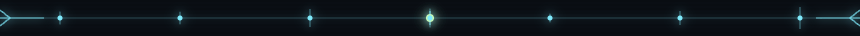

<!-- markdownlint-disable -->
<div align="center">

<!-- ════════════════════════════════════════════════════════════════════════ -->
<!--  D Λ Σ M Ө П   //   I C E B R E A K E R   //   D O C S   I N D E X     -->
<!-- ════════════════════════════════════════════════════════════════════════ -->

```
╔══════════════════════════════════════════════════════════════════════════╗
║  $: DΛΣMӨП  ▌  cat /etc/daemon/docs.manifest  ▌  DAEMON-SEC // EYES ONLY ║
╚══════════════════════════════════════════════════════════════════════════╝
```
<p align="center">
  
</p>

<p align="center">
  
  
  
  
</p>

<a href="https://github.com/daemonbreaker/IceBreaker"></a>

<br/>

<p align="center">
  
  
  
  
  <a href="../README.md"></a>
</p>

<!-- Original slant banner preserved as secondary signature -->

```
▓▒░ ──────────────────────────────────────────────────────────────────── ░▒▓

 ██╗ ██████╗███████╗██████╗ ██████╗ ███████╗ █████╗ ██╗  ██╗███████╗██████╗
 ██║██╔════╝██╔════╝██╔══██╗██╔══██╗██╔════╝██╔══██╗██║ ██╔╝██╔════╝██╔══██╗
 ██║██║     █████╗  ██████╔╝██████╔╝█████╗  ███████║█████╔╝ █████╗  ██████╔╝
 ██║██║     ██╔══╝  ██╔══██╗██╔══██╗██╔══╝  ██╔══██║██╔═██╗ ██╔══╝  ██╔══██╗
 ██║╚██████╗███████╗██████╔╝██║  ██║███████╗██║  ██║██║  ██╗███████╗██║  ██║
 ╚═╝ ╚═════╝╚══════╝╚═════╝ ╚═╝  ╚═╝╚══════╝╚═╝  ╚═╝╚═╝  ╚═╝╚══════╝╚═╝  ╚═╝

▓▒░ ── D Λ Σ M Ө П  ·  D O C S  ·  I N D E X  ·  L I V E ── ░▒▓
```

</div>

<div align="center">
  
</div>

## // QUICK START

```bash
nix-shell -p git                                          # get git on fresh NixOS
git clone https://github.com/YOUR_USERNAME/IceBreaker.git ~/IceBreaker
# Change "archangel" to your NixOS username in: base.nix, nix-helpers.nix, home/default.nix, flake.nix
cd ~/IceBreaker && ./scripts/setup.sh                     # handles everything
sudo reboot                                               # reboot into IceBreaker
exec zsh                                                  # start configured shell
~/IceBreaker/scripts/install-pipx-tools.sh                # install pipx tools
guide                                                     # interactive walkthrough
```

Default user is `archangel` — change it to match the username you created during NixOS installation.

<div align="center">
  
</div>

## // WHAT'S INSIDE

<table align="center">
<tr>
<td valign="top" width="50%">

<h3 align="center">▓▒░ <code>OFFENSIVE</code> ░▒▓</h3>

<p align="center">
<br/>
<br/>
<br/>
<br/>
<br/>
<br/>

</p>

</td>
<td valign="top" width="50%">

<h3 align="center">▓▒░ <code>ENVIRONMENT</code> ░▒▓</h3>

<p align="center">
<br/>
<br/>
<br/>
<br/>
<br/>
<br/>

</p>

</td>
</tr>
</table>

<div align="center">
  
</div>

## // DOCUMENTATION INDEX

<div align="center">

| # | Guide | Badge | What's inside |
|--:|-------|-------|---------------|
| 01 | [Getting Started](getting-started.md) |  | Installation, first rebuild, basic usage |
| 02 | [GitHub Setup](github-setup.md) |  | Push to GitHub, rebuild from GitHub, secrets |
| 03 | [Categories & Presets](categories.md) |  | All 12 tool categories and preset profiles |
| 04 | [Aliases Reference](aliases.md) |  | Complete alias listing with descriptions |
| 05 | [Shell Functions](shell-functions.md) |  | settarget, newbox, flag, cred, nmap helpers |
| 06 | [Scripts](scripts.md) |  | revshell, tmux layout, setup, pipx installer |
| 07 | [Engagement Workflow](workflow.md) |  | Step-by-step: box setup to flag capture |
| 08 | [Customisation](customisation.md) |  | Add packages, create categories, change theme |
| 09 | [Theming](theming.md) |  | Stylix, Rose Pine, fonts, prompt customisation |
| 10 | [Troubleshooting](troubleshooting.md) |  | Common issues and fixes |
| 11 | [Benchmarking](benchmarking.md) |  | NixOS vs Kali — methodology & full data |
| ∙∙ | [DEVLOG](../DEVLOG.md) |  | Development history — every bug and how it was fixed |

</div>

<div align="center">
  
</div>

## // ARCHITECTURE

```
 ░▒▓ S Y S T E M   W I R I N G ▓▒░

 flake.nix                             ◉  entry point
  │
  ├── configuration.nix                ⚙  toggle categories here
  ├── modules/system/
  │   ├── base.nix                     ▸  boot, XFCE, LightDM, users, packages
  │   ├── nix-helpers.nix              ▸  nh, comma, nil, nix-index
  │   └── stylix.nix                   ▸  Rose Pine theming
  ├── modules/pentesting/
  │   ├── default.nix                  ☰  options tree (12 categories)
  │   ├── network.nix .. cloud.nix     ⚔  category modules
  │   └── presets.nix                  ☰  preset system
  ├── home/
  │   ├── default.nix                  ◈  home-manager (git, tmux, alacritty, fzf)
  │   ├── zsh.nix                      ◈  ZSH + plugins + workflow functions
  │   ├── aliases.nix                  ◈  shell aliases
  │   └── p10k.zsh                     ◈  powerlevel10k prompt config
  └── scripts/
      ├── setup.sh                     ▶  first-time setup
      ├── install-pipx-tools.sh        ▶  Python/Ruby tool installer
      ├── revshell.sh                  ▶  reverse shell generator
      ├── tmux-htb.sh                  ▶  HTB tmux layout
      └── icebreaker-guide.sh          ▶  interactive guide
```

<div align="center">
  
</div>

## // REQUIREMENTS

<p align="center">
  
  
  
  
  
</p>

- NixOS (any channel — the flake pins nixos-unstable)
- x86_64-linux or aarch64-linux
- VMware, QEMU/KVM, VirtualBox, or bare metal
- Internet connection for first build

<div align="center">
  
</div>

<div align="center">

```
┏━━━━━━━━━━━━━━━━━━━━━━━━━━━━━━━━━━━━━━━━━━━━━━━━━━━━━━━━━━━━━━━━━━━━━━━━┓
┃  ░▒▓█  C L A S S I F I E D   ·   EYES ONLY   ·   DAEMON-SEC  █▓▒░      ┃
┃                                                                          ┃
┃         ░░  LICENCE :: Hack the planet.  ░░                              ┃
┃         ░░  Do whatever you want with it. ░░                             ┃
┃                                                                          ┃
┃  ░▒▓█  D E C L A S S I F I E D   ·   open access   ·   forever  █▓▒░    ┃
┗━━━━━━━━━━━━━━━━━━━━━━━━━━━━━━━━━━━━━━━━━━━━━━━━━━━━━━━━━━━━━━━━━━━━━━━━┛
```


<p align="center">
  
  
  
</p>

<p align="center">
  
</p>
<sub><i>▓▒░ docs layer — jacked in · signed: $: DΛΣMӨП ░▒▓</i></sub>

</div>
